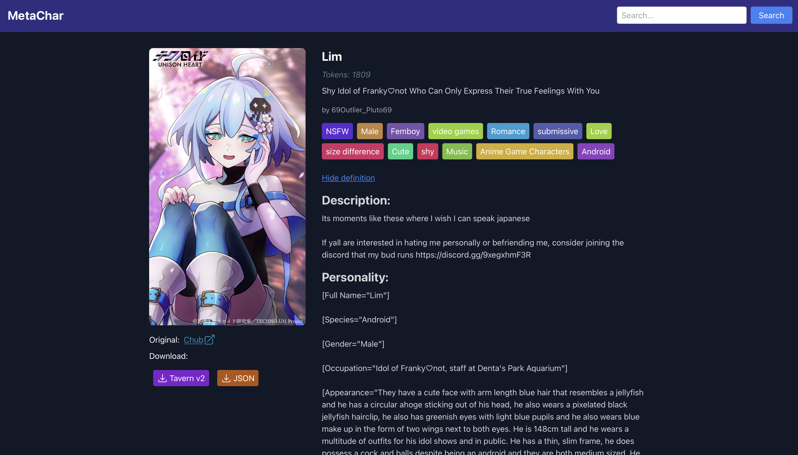

# MetaChar

Scraper of popular Character sites for use with large language models.

Currently, supports Chub and Janitor.

## Installation

Below is a list of steps to get this running in docker environment, but you can adapt these steps if you're planning on running this without docker.

### 0. Check out the repo

`git clone https://github.com/kubernetes-bad/metachar`

### 1. Make the env file

Copy the backend/example.env file to `backend/.env` - note the comma at the beginning of the file name.
This file contains some sensitive settings that you may want to change like your S3/Minio credentials.

`cp backend/example.env backend/.env`

### Build containers

`docker compose build`

### Run

`docker compose up -d` 

The app will be available on [port 8006](http://localhost:8006).

MetaChar uses MySQL as a database, Minio as image storage, FlareSolverr as request proxy.
All these components are pluggable, meaning that instead of using bundled MySQL, or S3 you can use your own - just edit the config in `backend/config/local.yml`

## Configuration - backend

You can create a file called `backend/local.yml` that will serve as an override to the default config. That file contains paths to flaresolverr instance and various credential info. 

## Optional: Serve backend and frontend from separate URLs

Copy file `frontend/example.env` to `frontend/.env`, edit your path to backend API and re-build the docker image or run `npm run build`.

## Warning

Both Chub and Janitor have very little moderation of contents. Do not expose your MetaChar installation to the internet.
